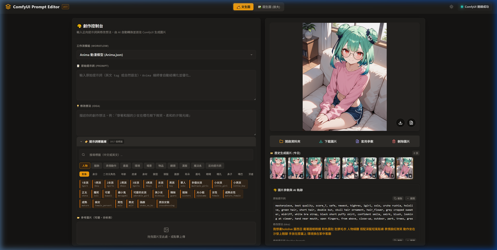

# ComfyUI AI Chat - 角色設計助手

基於 FastAPI + Vue 3 的 AI 角色設計對話與圖片生成系統，支援 OpenCode / Google AI 多模態對話，並整合 ComfyUI 進行高品質圖片生成。



## 功能特色

- **AI 多模態對話** — 支援文字與圖片輸入，可附加圖片讓 AI 分析
- **圖片生成** — 透過 ComfyUI API 生成角色圖片，支援完整參數調整
- **Session 管理** — 多對話 Session，完整保存聊天記錄與生成圖片
- **思考過程顯示** — AI 的 `<thought>` 推理過程可折疊查看
- **Markdown 渲染** — AI 回覆支援完整 Markdown 格式

## 系統架構

```
FastAPI 後端 (port 由 BACKEND_PORT/APP_PORT 控制，預設 8000)
└── 服務 Vue 3 SPA (frontend/dist/)
└── REST API (/api/...)

Vue 3 前端 (Vite 開發伺服器 port 3000，代理 /api → 後端埠號)
├── /chat  — 對話頁面（支援圖片拖曳）
└── /draw  — 圖片生成頁面
```

## 系統需求

- Python 3.10+
- Node.js 18+（僅開發/建置時需要）
- ComfyUI 運行於 `http://127.0.0.1:8188`
- OpenCode API Key **或** Google AI API Key

## 快速開始

### 1. 安裝 Python 依賴

```bash
python -m venv .venv

# Windows
.venv\Scripts\activate

# Linux / macOS
source .venv/bin/activate

pip install -r requirements.txt
```

### 2. 設定環境變數

```bash
# Windows
copy .env.example .env

# Linux / macOS
cp .env.example .env
```

開啟 `.env`，至少填入以下必要項目：

```ini
# 選擇 AI 供應商："opencode" 或 "google"
AI_PROVIDER=opencode

# 後端啟動埠號（你可改成 8002、8010... 避免衝突）
BACKEND_PORT=8000

# OpenCode API
OPENCODE_API_KEY=your_opencode_api_key_here

# 或 Google AI
# GOOGLE_API_KEY=your_google_api_key_here
```

### 3. 確認 ComfyUI 已啟動

確保 ComfyUI 運行於 `http://127.0.0.1:8188`，並已載入所需模型。

---

## 啟動方式

### 方式一：生產模式（推薦）

先建置前端，再啟動後端。Frontend 由 FastAPI 直接服務。

```bash
# 1. 建置前端（首次或修改前端後執行）
cd frontend
npm install
npm run build
cd ..

# 2. 啟動後端
python -m app.server
```

訪問：`http://localhost:<BACKEND_PORT>`

---

### 方式二：開發模式（前後端分離熱重載）

後端和前端分別啟動，支援雙向熱重載。

**終端 1 — 啟動後端**
```bash
python -m app.server --reload
```

**終端 2 — 啟動前端開發伺服器**
```bash
cd frontend
npm install
npm run dev
```

訪問：`http://localhost:3000`（Vite 代理 `/api` 到後端）

> Vite 開發代理會自動讀取專案根目錄 `.env` 的 `BACKEND_PORT`（若未設定則使用 `APP_PORT`）。

---

## 使用說明

本系統提供流暢的 AI 協作角色設計體驗，請遵循以下步驟使用：

1. **確保服務皆已啟動**：
   * 啟動 ComfyUI 伺服器（預設 `http://127.0.0.1:8188`）並加載對應模型（例如 `Anima` 或 `Qwen`）。
   * 依據 [啟動方式](#啟動方式) 執行本系統。
2. **建立設計對話 Session**：
   * 點擊左側邊欄的 **「+ 新增對話」** 建立對話 Session。
3. **AI 協作與提示詞自動生成** (`/chat` 頁面)：
   * 在對話框中輸入您的角色設計想法（可用中文或口語描述，如：「我想做一個戴著圓框眼鏡、粉色露肚臍毛衣的綠髮動漫女孩」）。
   * AI 會將您的口語描述重寫並翻譯為高品質的 Stable Diffusion 英文提示詞，並**自動送往 ComfyUI 進行繪圖**。
   * 您可以點擊 AI 回覆上方的 **`<thought>` 摺疊區塊**，查看 AI 完整的思考與重寫推理過程。
4. **手動參數調整與生圖** (`/draw` 頁面)：
   * 您可以在左側的 **「創作控制台」** 自由切換工作流模組、手動調整圖片尺寸（支援快速預設按鈕，如 Mobile、4:5、9:16、16:9）、調整 Steps、CFG、Seed、Sampler 等參數。
   * 輸入自訂正向與負向提示詞後，點擊 **「生成圖片」** 按鈕手動生成。
5. **歷史記錄與參數溯源**：
   * 右側區域會實時顯示最新生成的圖片，並提供 **「開啟資料夾」**（在 Windows 檔案總管中開啟輸出路徑）、**「下載圖片」** 與 **「套用參數」**（一鍵將歷史圖片的參數帶回控制台）等功能。
   * 在右下角的 **「圖片參數與 AI 軌跡」**，可完整回溯該張圖片生成的 Prompt 變化脈絡（原始想法 -> 修改想法 -> 最終 Positive Prompt）。

---

## 工作流配置方式

本系統具備高度彈性的 ComfyUI 工作流（Workflow）載入與解析機制，所有可用的工作流皆存放於 [workflow/](file:///d:/comfyuiAPi/workflow) 目錄。

### 1. 工作流自動掃描與參數匹配
系統啟動時會自動掃描 [workflow/](file:///d:/comfyuiAPi/workflow) 下的 `.json` 檔案。依據檔案名稱，系統會為其套用預設的 UI 參數（Steps、CFG、Sampler 等）：
* **檔名包含 `anima`（不區分大小寫）**：
  * **顯示名稱**：`Anima 動漫模型`
  * **預設參數**：Steps=35, CFG=4.0, 600x1328, Sampler=`dpmpp_2m_sde`, Scheduler=`simple`
  * **預設負向詞**：高品質動漫專用 EasyNegative 組合。
* **檔名包含 `放大` 或 `upscale`**：
  * **顯示名稱**：`Anima 放大/圖生圖`
  * **預設參數**：Steps=14, CFG=5.0, 1536x1536, Sampler=`er_sde`, Scheduler=`sgm_uniform`
* **檔名包含 `qwen`（不區分大小寫）**：
  * **顯示名稱**：`Qwen Image 模型`
  * **預設參數**：Steps=12, CFG=1.0, 608x1328, Sampler=`dpmpp_2m_sde_gpu`, Scheduler=`simple`
* **其他自訂檔名**：
  * **顯示名稱**：直接以檔名作為顯示名稱。
  * **預設參數**：Steps=20, CFG=7.0, 512x512, Sampler=`euler`, Scheduler=`normal`

> [!TIP]
> 您可以在根目錄的 `.env` 檔案中，修改 `DEFAULT_WORKFLOW` 變數來指定預設載入的工作流（例如：`DEFAULT_WORKFLOW=anima`）。

### 2. 自訂 ComfyUI 工作流規範
系統的 [ComfyUIAdapter](file:///d:/comfyuiAPi/app/infrastructure/adapters/comfyui_adapter.py) 同時支援兩種工作流 JSON 格式：
1. **UI 格式（GUI 匯出）**：從 ComfyUI 網頁直接點選 `Save` 導出的 JSON（檔案中包含 `"nodes"` 列表）。
2. **API 格式（Developer 模式匯出）**：開啟 ComfyUI 開發者模式（Developer Mode）後點擊 `Save (API Format)` 導出的 JSON。

若要放入自訂工作流，請確保其包含以下特定節點，系統才能正確地將前端的 Prompt、寬高、步數等參數注入：

#### 規範 A：若使用 **UI 格式（GUI 匯出）**
系統使用固定 **Node ID** 進行值替換，請確保以下節點的 ID 與類型一致：
* **Node ID 6** (`CLIPTextEncode`)：正向提示詞（Positive Prompt）
* **Node ID 7** (`CLIPTextEncode`)：負向提示詞（Negative Prompt）
* **Node ID 3** (`KSampler`)：採樣器設定（更新 Seed, Steps, CFG, Sampler, Scheduler）
* **Node ID 58** (`EmptySD3LatentImage` 或相容節點)：設置輸出解析度（Width, Height）
* **LoadImage** 節點（若為圖生圖）：會自動將上傳的圖片檔名寫入其第一個 widgets_values。
* **CheckpointLoaderSimple / UNETLoader**：自動將所選的 Checkpoint 模型檔名寫入。

#### 規範 B：若使用 **API 格式（推薦）**
系統改由節點的 `class_type` 與 `_meta.title` 進行匹配，相容性更高且不受 ID 限制：
* **正向提示詞**：`class_type` 為 `CLIPTextEncode` 且標題 (`_meta.title`) 包含 `positive` 的節點（或其上游連接的 Multiline String 節點）。
* **負向提示詞**：`class_type` 為 `CLIPTextEncode` 且標題 (`_meta.title`) 包含 `negative` 的節點（或其上游連接的 Multiline String 節點）。
* **採樣器**：`class_type` 為 `KSampler` 或 `Input Parameters (Image Saver)` 的節點。
* **寬高解析度**：`class_type` 為 `EmptyLatentImage` 或 `EmptySD3LatentImage` 的節點。
* **上傳參考圖**：`class_type` 為 `LoadImage` 節點。
* **模型加載器**：`class_type` 為 `CheckpointLoaderSimple` 或 `UNETLoader` 等，系統會動態寫入 `ckpt_name` / `unet_name`。

---

## 專案結構

```
comfyuiAPi/
├── app/                        # Python 後端 (Clean Architecture)
│   ├── main.py                 # FastAPI 入口，服務 Vue SPA + API
│   ├── config.py               # Pydantic 設定
│   ├── server.py               # 後端啟動入口（讀取 .env host/port）
│   ├── application/
│   │   ├── services/           # 業務邏輯
│   │   └── dtos/               # 資料傳輸物件
│   ├── domain/
│   │   ├── models/             # 領域模型
│   │   └── exceptions.py
│   ├── infrastructure/
│   │   ├── adapters/           # AI 適配器（OpenCode / Google / ComfyUI）
│   │   └── repositories/       # 資料儲存
│   └── presentation/
│       └── routes/             # API 路由
│
├── frontend/                   # Vue 3 + Vite 前端
│   ├── src/
│   │   ├── views/              # ChatView.vue, DrawView.vue
│   │   ├── components/         # SessionSidebar.vue, MessageBubble.vue
│   │   ├── stores/             # sessionStore.js（共享狀態）
│   │   ├── router/             # vue-router
│   │   └── utils/              # thoughtFilter.js
│   └── dist/                   # 建置輸出（gitignored，執行前需 npm run build）
│
├── workflow/                   # ComfyUI Workflow JSON
│   ├── qwen image.json         # 輕量模型（Steps=12, CFG=1.0）
│   └── Anima.json              # 動漫模型（Steps=35, CFG=4.0）
│
├── sessions/                   # Session 資料（gitignored）
├── logs/                       # 日誌（gitignored）
├── outputs/                    # 舊版輸出目錄（gitignored）
├── .env.example                # 環境變數範本
└── requirements.txt
```

## API 端點

### Session
| 方法 | 路徑 | 說明 |
|------|------|------|
| `POST` | `/api/sessions` | 建立 Session |
| `GET` | `/api/sessions` | 列出所有 Session |
| `GET` | `/api/sessions/{id}` | 取得 Session 詳情 |
| `PUT` | `/api/sessions/{id}/title` | 更新標題 |
| `DELETE` | `/api/sessions/{id}` | 刪除 Session |

### Chat
| 方法 | 路徑 | 說明 |
|------|------|------|
| `POST` | `/api/chat/send` | 發送訊息（支援 `image_base64` + `image_mime_type`）|
| `GET` | `/api/chat/history/{session_id}` | 取得聊天記錄 |

### Image
| 方法 | 路徑 | 說明 |
|------|------|------|
| `POST` | `/api/image/generate` | 呼叫 ComfyUI 生成圖片 |
| `GET` | `/api/image/view/{session_id}/{filename}` | 顯示圖片 |
| `GET` | `/api/image/download/{session_id}/{filename}` | 下載圖片 |
| `GET` | `/api/image/list/{session_id}` | 列出 Session 圖片 |

## 環境變數說明

完整範本見 `.env.example`。常用項目：

| 變數 | 說明 | 預設值 |
|------|------|--------|
| `AI_PROVIDER` | `opencode` 或 `google` | `opencode` |
| `OPENCODE_API_KEY` | OpenCode API Key | — |
| `GOOGLE_API_KEY` | Google AI API Key | — |
| `PROMPT_TEMPLATE` | `qwen` 或 `anima` | `qwen` |
| `COMFYUI_API_URL` | ComfyUI 地址 | `http://127.0.0.1:8188` |
| `BACKEND_PORT` | 後端啟動 Port（優先使用） | `8000` |
| `APP_PORT` | 後端監聽 Port（相容舊設定） | `8000` |
| `FRONTEND_DIR` | Vue dist 目錄 | `./frontend/dist` |

## 故障排除

**ComfyUI 無法連線**
- 確認 ComfyUI 正在運行：`http://127.0.0.1:8188`
- 檢查 `COMFYUI_API_URL` 設定

**AI API 錯誤**
- 確認 API Token 有效且有配額
- 檢查 `AI_PROVIDER` 與對應的 Token 變數是否匹配

**前端顯示空白**
- 確認已執行 `npm run build`（生產模式）
- 或確認 Vite dev server 已啟動（開發模式）

**查看詳細錯誤**
```bash
cat logs/app.log
```

## 授權

MIT License
